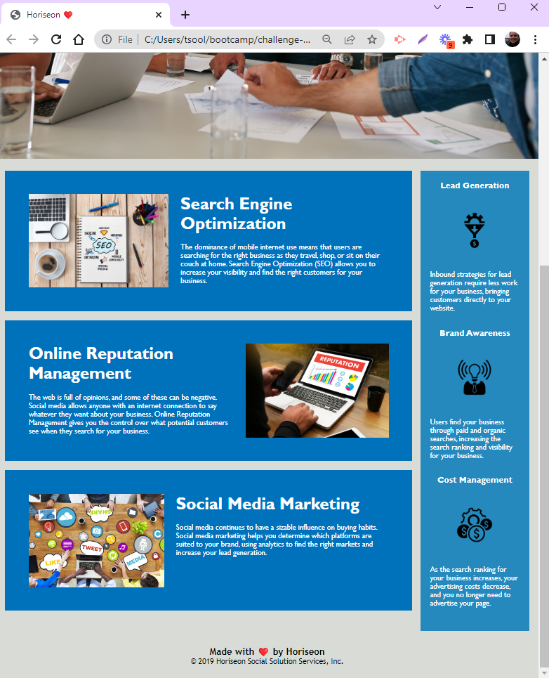

# challenge-01-horiseon

challenge-01-horiseon

## Description

The client, Horiseon, have requested to update their current website to include current accessibility standards.  

The following is the client's User Story.

AS A marketing agency
I WANT a codebase that follows accessibility standards
SO THAT our own site is optimized for search engines

The skills learned were the ability to update current html and css syntax with sematic syntax is order for accessibilty tools to read the website.

## Usage

There are two goals of the website which are to advertise the companies services but also add sematic elements to the website for accessibilty software (AIM) to read it.

Screenshots of website:

   
    
    

## Credits

Credits go to UNB Coding Bootcamp and the coding skills taught to update the website with sematic elements.

## Features

1. Can be read by AIM
2. Sections have been appropriately named instead of 
.

